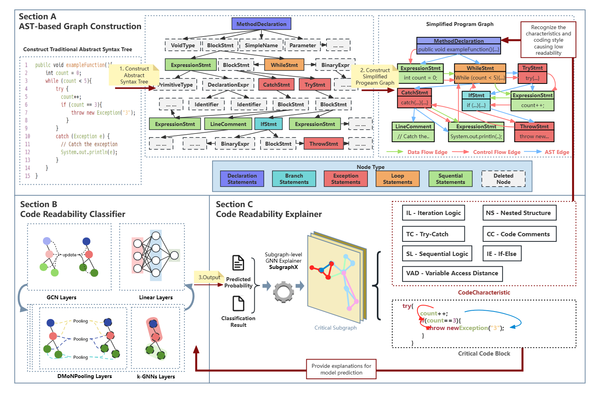

# Towards Explainable Code Readability Classification with Graph Neural Networks
This is the repository for our paper *Towards Explainable Code Readability Classification with Graph Neural Networks*.

## Abstract


**Context:** Code readability is of central concern for developers, since a more readable code indicates higher
maintainability, reusability, and portability. In recent years, many deep learning-based code readability
classification methods have been proposed. Among them, a Graph Neural Network (GNN)-based model has
achieved the best performance in the field of code readability classification. However, it is still unclear what
aspects of the model’s input lead to its decisions, which hinders its practical use in the software industry.
**Objective:** To improve the transparency of code readability classification models and reveal key code
characteristics that drive their assessments, we develop a GNN explainer-based interpretability framework to
analyze decision patterns in GNN-based classification models’ readability predictions. **Method:** First, 
we propose a simplified Abstract Syntax Tree (AST)-based code representation method, which transforms Java
code snippets into ASTs and discards lower-level nodes with limited information. Then, we retrain the state-
of-the-art GNN-based model together with our simplified program graphs. Finally, we employ SubgraphX to
explain the model’s code readability predictions at the subgraph-level and visualize the explanation results to
further analyze what causes such predictions. **Result:** The experimental results show that sequential logic,
code comments, selection logic, and nested structure are the most influential code characteristics when
classifying code snippets as readable or unreadable. Further investigations indicate the model’s proficiency
in capturing features related to complex logic structures and extensive data flows but point to its limitations
in identifying readability issues associated with naming conventions and code formatting. **Conclusion:** The
explainability analysis conducted in this research is the first step toward more transparent and reliable code
readability classification. We believe that our findings are useful in providing constructive suggestions for
developers to write more readable code and delimitating directions for future model improvement.

## Project Structure
```
Explainability
├─Code
│  └─checkpoint
│      ├─code_hh
│      └─code_readability_new
├─Dataset
│  ├─Neutral
│  ├─Readable
│  └─Unreadable
├─explanation
│  ├─explainer
│  └─utils
├─newResults
│  ├─readable
│  └─unreadable
├─Questionnaire
└─result
```

### Code Folder
In `Code` folder:
- `code_dataset.py` file achieves pipeline of constructing AST-based program graphs.
- `Code/checkpoint/code_readability_new` folder stores the best gcn model parameters after five fold training. These model files can be applied by Pytorch library through using `model.load_state_dict(torch.load(model_path))`.
### Dataset Folder
In `Dataset` folder:
- `Dataset/Neutral` folder stores the code snippets that are labeled as neutral.
- `Dataset/Readable` folder stores the code snippets that are labeled as readable.
- `Dataset/Unreadable` folder stores the code snippets that are labeled as unreadable.
### explanation Folder
In `explanation` folder:
- `explanation/explainer` folder stores the implementation of SubgraphX.
- `explanation/explaining_subgraphx.py` file achieves the entire pipeline of graph construction, GNN-based model training and GNN interpretation with SubgraphX.
- `explanation/input.pkl` file stores the input data for the GNN-based model. This file can be applied by Pytorch library through using `pkl_file = pd.read_pickle(pkl_path)`.
### newResults Folder
In `newResults` folder, all the visualized interpretation results (png files) are stored：
- `newResults/readable` folder stores the visualized interpretation results of code snippets that are judged as readable.
    - `newResults/readable/Scalabrino{i}.png` file shows the visualized interpretation result of the code snippet.
    - `newResults/readable/Scalabrino{i}.java.pt` file stores the intermediate results of the interpretation process.
- `newResults/unreadable` folder stores the visualized interpretation results of code snippets that are judged as unreadable.
### Questionnaire Folder
In `Questionnaire` folder:
- `Questionnaire/data_analysis.ipynb` file achieves the data analysis process of the questionnaire.
- `Questionnaire/questionnaire.pdf` file shows the content of the questionnaire.
- `Questionnaire/questionnaire_modified.pdf` file is a revised questionnaire in accordance with the requirements of gender inclusion and survey rigor.
- `Questionnaire/questionnaire_results.xlsx` file stores the raw data of the questionnaire.
### result Folder
In `result` folder, all predictions of the gcn classifier on the dataset are stored here.


## Setup
```bash
    conda create -n CodeReadability python=3.9
```
```bash
    conda activate CodeReadability
```
The detailed versions of dependencies are recorded in `requirement.txt` file, run the following script to install.
```bash
    pip install -r requirements.txt
```
Then, you can run the following script to start the entire pipeline of graph construction, GNN-based model training and GNN interpretation with SubgraphX.
```bash
    cd explanation
    python explaining_subgraphx.py
```

## Explanation of Files with Uncommon Extensions
In this repository, several files with uncommon extensions are used. Below is a detailed explanation of their purposes and the methods to load them:
### `.pt` & `.pth` Files
Files with the `.pt` & `.pth` extension store the trained model parameters. These are generated during the training process of the GNN-based model and are essential for making predictions or further fine-tuning.

To load a `.pt` & `.pth` file, you can use the PyTorch library as follows:
```python
import torch
model = torch.load("model.pt") # model = torch.load("model.pth")
```

### `.ipynb` Files
Files with the `.ipynb` extension are Jupyter Notebook files. These are used for interactive data analysis, visualization, and documentation purposes. For example, `Questionnaire/data_analysis.ipynb` contains the data analysis process for the questionnaire results.

To open and run a .ipynb file, you need to install Jupyter Notebook or JupyterLab. Use the following commands to start Jupyter Notebook:
```bash
    jupyter notebook
```
Then, navigate to the directory containing the `.ipynb` file and open it in the browser.

### `.pkl` Files
Files with the `.pkl` extension are used to store serialized Python objects. In this project, `explanation/input.pkl` contains the input data for the GNN-based model. These files are useful for saving and loading complex data structures such as dictionaries, lists, or custom objects.

To load a `.pkl` file, you can use the Pandas library as follows:
```python
import pandas as pd
data = pd.read_pickle("input.pkl")
```